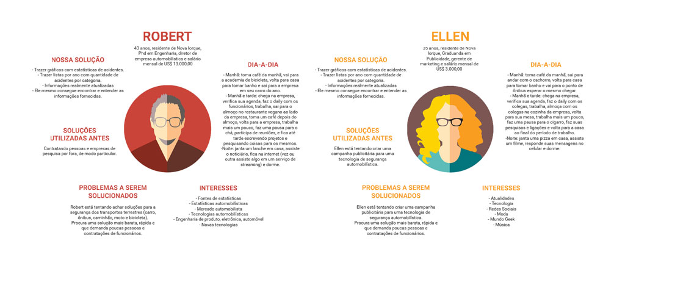
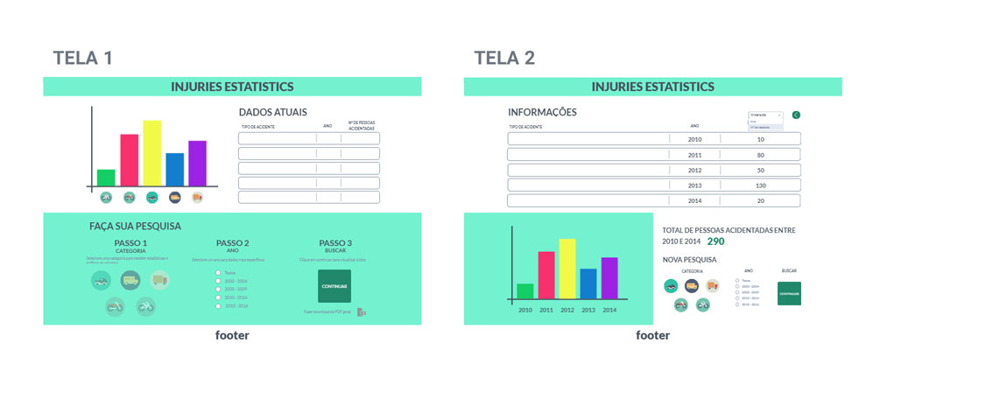
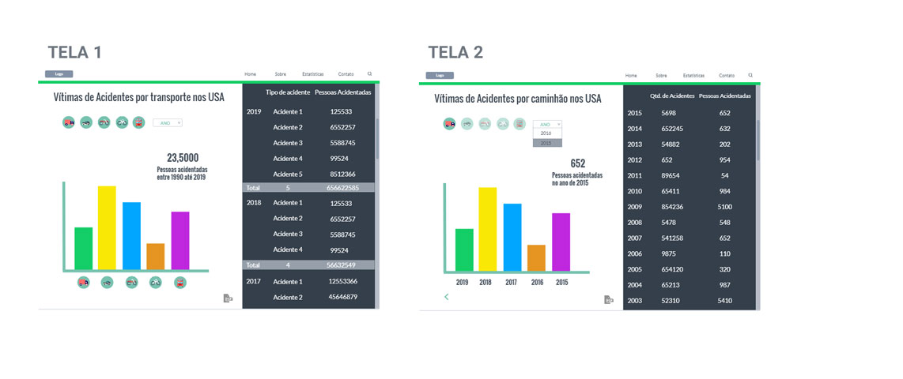
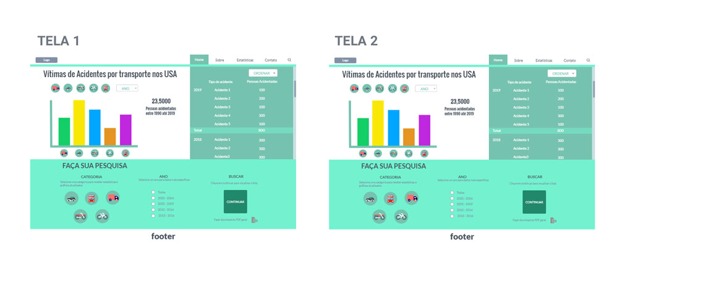

# Data-Lovers

---
## Resumo do projeto

---
## Usuário | Persona
Como usuário do nosso produto definimos *Startups* de tecnologia focadas em desenvolvimento de produtos de segurança para o transporte, como sensores, *airbags* e outros. Elas buscam a quantidade de acidentes causados por meio de transportes terrestres nos EUA e usam nossa plataforma para coleta de estatísticas através de listas e gráficos.
Assim, foram criadas 2 personas que usariam nossa plataforma para essas empresas:

---
## Protótipo | Teste de usabilidade
Para ter uma melhor resposta do retorno da usabilidade, fizemos 2 protótipos, que foram testados por 5 usuários cada, e recebemos alguns *feedbacks* sobre as opções.

### Protótipo 1
[link para teste]
(https://marvelapp.com/1d8c9f8g)

>*Feedbacks* - o passo a passo facilita entender como pesquisar, mas ao mesmo tempo torna muito infantil. A mudança de tela fica estranha pois o gráfico muda de posição e a busca fica muito estreita. As informações ficam muito coladas na segunda tela.

### Protótipo 2
[link para teste]
(https://marvelapp.com/b2e0160)

>*Feedbacks* - a tela única deixa mais simples de entender, mas as informações laterias estão um pouco confusas. A busca está muito complicada de entender, não deixando muito claro onde clicar.

###Protótipo Final
[link para teste]
(https://marvelapp.com/)

>Juntamos os pontos positivos dos dois protótipos e resultamos em uma página só, com a busca facilitada na parte debaixo.

---
## Hacker Edition
* Carregar arquivo .json com o uso de fetch()
* Visualizações gráficas usando bibliotecas [Chart.js](https://www.chartjs.org/) ou [Google Charts](https://developers.google.com/chart/)